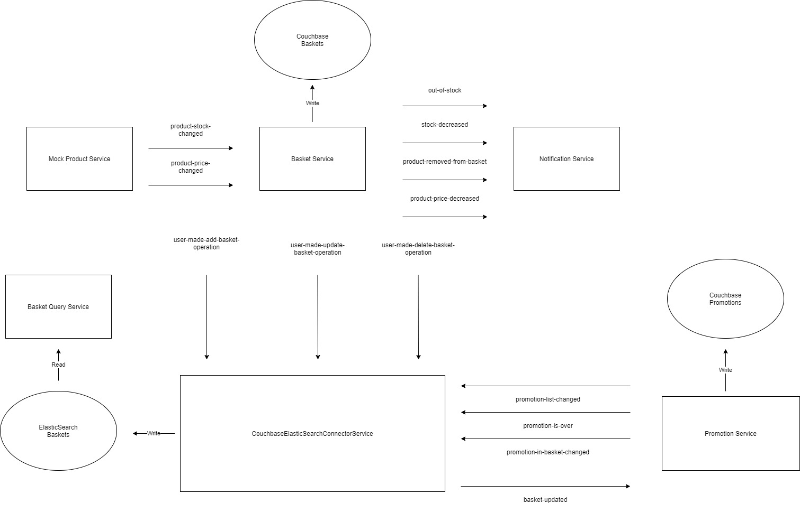

# e-Commerce Microservices

Günde milyonlarca istek ve event gelebilecek e-ticaret sitesi sepet servisini baştan tasarladım.

**Microservices Patterns: With Examples in Java** kitabının pdf'ini bulup farklı design patternlara baktığımda **CQRS** mimarisinin benim durumum için uygun olduğunu gördüm çünkü elimde bir data yoktu fakat kendi deneyimimden bir e-ticaret sitesine girdiğimde sepete ekleme çıkarma yapmaktan daha çok sepeti açıp hangi ürünler varmış diye bakıyorum. Bu yüzden yazma ve okuma işlemlerini ayırmak istedim ki hangi sisteme daha çok yük geliyorsa onu scale edebilelim.

# Teknoloji Seçimlerim
business logic'in yoğun olduğu domainlerde (Basket, Promotion, MockProduct, MockNotification) Java, performansın önemli olduğu çok fazla event dinleyip event atan ya da sorgu gönderilen servislerde (BasketQuery, Connector) Golang dilini tercih ettim.

Veritabanın yatay bir şekilde ölçeklenebilmesi için NoSql tabanlı veritabanlarını kullandım. Basket ve Promotion servislerinde Couchbase'i tercih ettim. BasketQuery servisinde ise daha hızlı cevap alabileceğimiz için ElasticSearch'ü tercih ettim.

Servisler arası iletişimi kafka ile event atarak sağladım çünkü servislerin birbirine olan bağımlılığını azaltmak istediğimden asenkron bir iletişim olmasını istedim.

**Basket Service**
Veritabanını tasarlarken önceliği product'a ardından da seller'a verdim çünkü product fiyat ya da stok güncellemeleri geldiğinde hızlıca bu ürünü sepete eklemiş tüm kullanıcılara erişebilirim. Eventleri polymorphic yapıyla ve observer patern kullanarak attım bu sayede yeni özelliklerde kod çok fazla kirlenmeyecek.

**Promotion Service**
Burada veriyi Promotion'lara öncelik vererek tutuyorum. Ayrıca dışarıdan kod bilmeyen birisi dinamik olarak yeni kampanya oluşturabilir. Bunun için Rest Api oluşturdum swaggerdan kolayca sabit fiyat indirimi, yüzde indirim, belirli bir alt sınıra ya da üst sınıra göre indirim, seller'a, product'a, user'a özel olacak şekilde bunları harmanlayarak istenilen kampanya oluşturulabilir. Yeni kampanya oluştuğunda ya da bittiğinde tüm basketler tekrar inceleniyor.

**Couchbase ElasticSearch Connector Service**
burada ise gelen eventlerin değerlendirilerek ElasticSearch'e yazılması gerekiyor. FP ile fonksiyonların içinde fonksiyon gönderek Polymorphism benzeri bir yapı kurmaya çalıştım biraz olsun kod kalabalığını engelledim ama hala pek temiz sayılmaz ilk go projemdi bu yüzden best practiselere pek hakim değilim.

**Mock Notification Service**
Burada yine Polymorphism'den faydalanarak tüm mesajları Notification objesinden inherit ettim. Bu sayede Observer Pattern ile tek bir send kodu ile Mail, Web, Mobile, Sms vb. tüm kanallara bildirim atabiliyorum.

